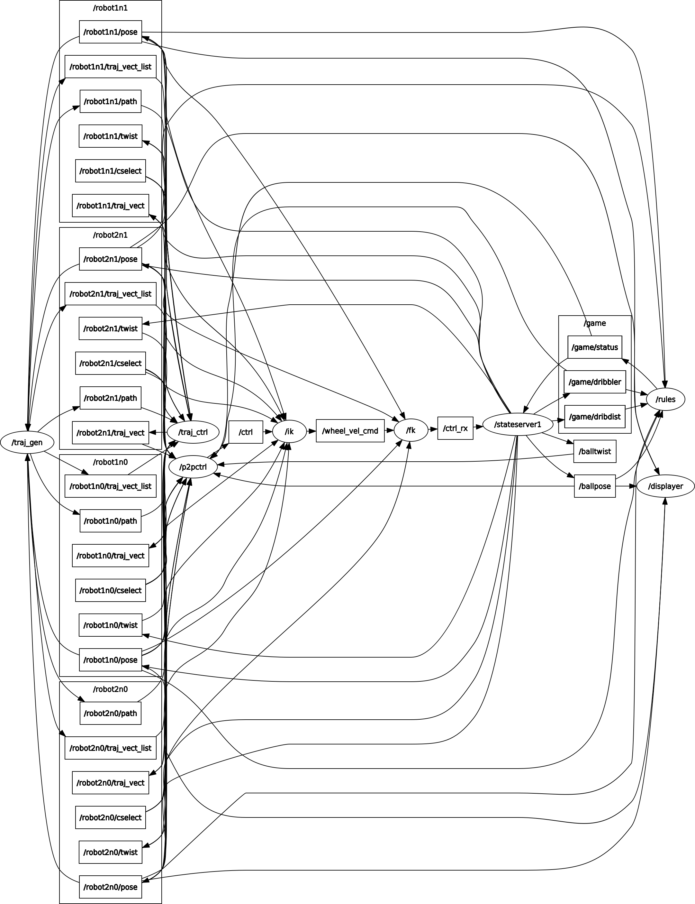
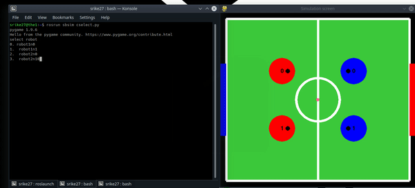
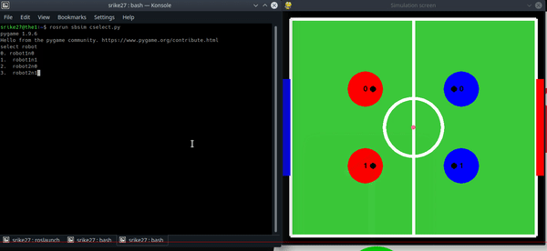

# Simulation of Soccerbots
 
<h2> Instructions to get it running:</h2>

 Install ROS kinetic on Ubuntu 16.04 (Developed and tested) 

 Install pygame, numpy for python 2.7 

 Inside location_of_catkin_ws/src/ mkdir sbsim

 Inside sbsim clone this repository

 go to location_of_catkin_ws and catkin_make

 
<h2> Work done </h2>

 
<h3>3 controller implementation</h3>

Point to point control

Trajectory Tracking control

3 wheel independent control

<h3> Proposed Rules For the game:</h3>
    * Robot's ball possession is legal only for x distance travelled. (x is tbd)  
    * If x is reached, bot must pass, shoot or kick ball and regain possession.  
    * Incase of collision, bot possesing the ball given freekick  
    * if ball goes out outside field of play, possesion is given to the opposition at the line.  

<h3> physics, controller and stateserver </h3>
    * Discrete time kinematics was used to model bot and ball.  
    * Used oblique collision model with suitable coefficient of restitution and inertias for collision physics  
    * Created a cascaded P controller for go to goal commands to bot  
    * added dribbler and kicker physics  
    * publishing goalmsgs to a particular bot triggers bot to go to goal  
    * publishes data as geometry_msgs/Pose 

<h3> Took data from stateserver and was able display as a simulation of the soccebots </h3>
    * Subscribes to geometry_msgs/Pose messages of ball pose, robot poses  
    * Used pygame to simulate the environment  

